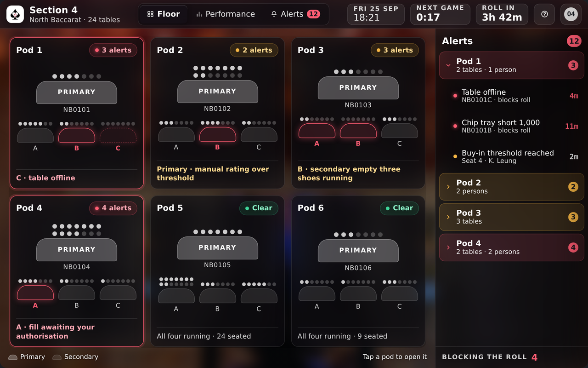
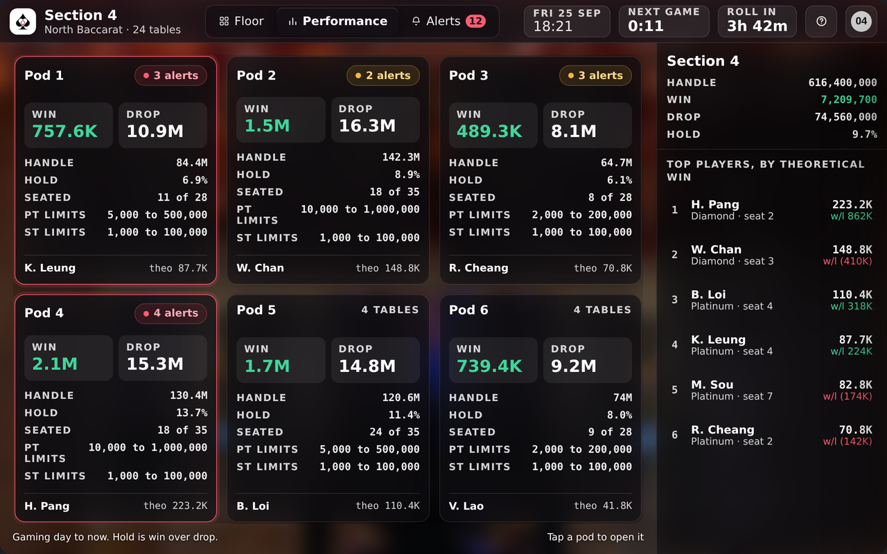

# LTG Supervisor Tablet — interaction prototype

A clickable prototype of the **Mobile Manager** supervisor tablet for Walker
Digital Table Systems' Linked Table Games programme. It exists to settle
interaction questions the requirements documents leave open, and to be argued
with. It is not production code.



<sub>Floor. Six equal pods; colour only where something needs attention.</sub>



<sub>Performance. Same six pods in the same places, carrying the money instead.</sub>

---

## Run it

No build step, no install, no toolchain. The repository **is** the app.

```bash
git clone <this repo>
cd ltg-supervisor-prototype
python3 -m http.server 5173      # or: npx serve .
```

Then open <http://localhost:5173> and enter the access code (see
**Access code** below).

It must be served over HTTP rather than opened as a `file://` path, because the
code is ES modules and browsers block module loading from the filesystem. Any
static server will do.

Target device is a **10-inch tablet in landscape, 1280×800**. The page renders
the device at exactly that size and scales it to fit your window, so what you
see is what lands on the tablet.

## Deploy it

**Read [NOTICE.md](NOTICE.md) before you push.** This repository carries client
material and WDTS brand assets, and on most plans a GitHub Pages site is
publicly reachable even when the repository itself is private. That is the one
decision to get right; everything below is mechanical.

```bash
git init            # if you are starting from the zip
git add -A && git commit -m "LTG supervisor tablet prototype"
git branch -M main
git remote add origin git@github.com:<you>/<repo>.git
git push -u origin main
```

`.github/workflows/pages.yml` then publishes on every push to `main`. Enable it
once under **Settings → Pages → Source → GitHub Actions**. There is nothing to
build, so the deploy is a file copy. `.nojekyll` is there so Pages serves the
files as they are if you ever switch to deploying from a branch instead.

### Access code

A code screen sits in front of the prototype. **Treat it as a doormat, not a
lock.** The site is static, so every file under `src/` is served whether or not
the gate has been passed, and a browser check is a browser check. What it buys
you is that a link forwarded to the wrong inbox does not open straight into
client work, and a `noindex` tag keeps the prototype out of search results.
(`robots.txt` is in the repo too, but on a project Pages site it sits at
`/<repo>/robots.txt` rather than the domain root, so crawlers ignore it. The
meta tag is the one doing the work.) If the material genuinely must not be seen, host it somewhere
with real authentication rather than relying on this.

The code is not in the repository. `src/gate.js` stores a SHA-256 digest of it
and the two lines that regenerate the digest for a new code. Send the code to
reviewers separately from the link. Unlocking lasts for the browser tab, so a
reviewer types it once per session, not once per screen.

---

## What it does

**Sign in.** Two paths, because the requirements ask for both: tap a card, or
key an ID. Any ID of four digits or more signs you in.

**Three levels of navigation.** All pods → one pod → one table. The top level
is six equal pod cards on a three-column grid: each card draws its own Primary
over its three Secondaries, with a seat dot per position, so the card is a
picture of the pod rather than a row in a list. The breadcrumb
and the back arrow climb out; tapping an alert at any level jumps straight to
the right depth with the right thing selected.

**One toggle, three states.** Floor / Performance / Alerts. The same six pods
in the same places: Floor shows where trouble is, Performance prints Handle,
Win, Drop, hold and table limits on the cards and puts the section's top
players in the panel, Alerts gives the tree the whole screen by moving the
split from 74/26 to 26/74. The two panes never change sides, pods stay left and
the panel stays right, so the supervisor never has to re-find anything.

Performance exists because the requirements want a money dashboard on the first
screen and the design wants an exception monitor. Both are right. Putting five
figures on each of six cards would destroy the glance the floor view exists
for, so the toggle carries the difference instead of one of them losing.

**An alert tree with three real levels**: pod, table, and person. Filters for
*blocking roll* and *needs my signature* are chips, not a menu, because those
are the two a supervisor actually reaches for.

**One player record instead of six screens.** Sessions, transactions, bankroll,
marker and RIM balances, notes and the conversion from anonymous to rated are
not six destinations. They are six things you want while standing next to one
person, so they are three columns of one sheet.

**Six table tabs, named for the task.** Live, Chips, Players, Sessions, Games,
Override. Games is arrived at holding a game number rather than read in order,
so the column that carries the weight is whether a person corrected the
outcome. Empty seats are a count, not fourteen rows.

**The Adjust flow, end to end.** Reason code, verification scan, then the
second signature on a keypad. Confirming it resolves for real: the variance
goes to zero, the alert disappears from the tree, the pod loses its crimson on
the floor, and the "blocking the roll" tally drops.

**Jargon tips.** A switch in the page chrome, outside the device, that marks
casino vocabulary on whatever screen you are looking at with a small badge and
a plain-English definition. It is a learning aid for the design team and not
part of the product: it lives in `lib/helptips.js` as a pass over the rendered
DOM, so no component knows it exists and nothing in the product is shaped by
it. Each entry says what the term means and why it changes a design decision.

**Two themes.** Light is WDTS brand. Dark is a glass treatment over a
photograph of a room, where every frosted surface desaturates and dims what is
behind it, so the room keeps its colour in the gutters and a card over the red
ceiling still reads as a neutral card.

**Type and contrast are measured, not judged.** Every piece of text in both
themes is checked node by node against its actual rendered background. Sizes
sit on one ladder rather than the twenty ad-hoc values they had drifted into.

Live countdown and alert ages tick while you look at it, because the pressure
the design is about is temporal. The tick rewrites four numbers in place and
touches nothing else: see `lib/live.js`.

---

## How it is put together

```
index.html                 the only page
src/
  app.js                   mount, state wiring, the one place actions are decided
  store.js                 state shape + reducer. Actions are plain data.
  types.js                 JSDoc typedefs — editors type-check with no build
  assets.js                asset URLs resolved natively via import.meta.url
  assets/                  WDTS logo and icon
  data/
    pods.js                six pods, four tables each. Swap for the LTG API.
                           Seven seat positions a side; fourteen is a full-size
                           table and draws as two rows.
    alerts.js              the twelve open alerts
    players.js             named records, then anonymous fill so every
                           occupied seat is a person
    games.js               completed games, including a shoe boundary
    thresholds.js          notification rules and who owns each one
    glossary.js            plain English for the design team. Not product.
  lib/
    dom.js                 a 30-line view layer (h / fragment / clear)
    selectors.js           every derived count lives here
    format.js              money, ages, clocks
    severity.js            colour has exactly one job: needs attention.
                           sevColor marks, sevInk words, sevOn words reversed
                           out of a filled chip
    live.js                the four values that change every second
    helptips.js            the jargon annotator. Not product.
  components/              one module per screen region
                           sheets.js and playersheet.js are full-device
                           overlays: you are never doing your job in one, so
                           nothing has navigated you away from what you were
                           doing
  styles/
    tokens.css             THE DESIGN SYSTEM — read this first
    base.css               page chrome around the device frame
    components.css         component styles, all referencing tokens
```

Three decisions worth knowing before you change anything:

**Everything counted is derived, never stored twice.** `lib/selectors.js`
computes pod severity, alert counts, seated totals and the blocking-roll tally
from the single list in `data/alerts.js`. That is why the floor cards, the
tree, the filter chips and the footer tally cannot drift apart. An earlier
draft stored these separately and immediately contradicted itself.

**`styles/tokens.css` is the deliverable.** Both themes are defined there and
nowhere else; no component hard-codes a colour. Dark is not a tint of light —
the brand crimson `#a81e33` all but vanishes on a dark ground, so dark mode
runs a lifted `#ff5c72`. That is a design-system decision for WDTS to confirm,
not a styling whim.

**No framework, deliberately.** `lib/dom.js` is a hyperscript helper and the
app re-renders from state on every change, which is the model a framework gives
you without the dependency, the install, or a build. Each component maps
one-to-one onto a React component if this is ever ported.

---

## What is real and what is not

Built out: sign-in, the floor plan in all three states, the pod switcher, the
alert tree at all three levels, pod detail with a panel that switches between
alerts and people, table detail with the Live / Chips / Players / Sessions /
Games tabs, the player record, notification thresholds, help, the account
sheet, the Adjust, Authorise-fill and Approve-rating flyouts, pod hold, and
scanning.

Stubbed with an explanation on screen: the **Override** tab.

Not modelled at all, because the WDTS requirements do not define it: the
**alert lifecycle** — acknowledge, escalate, auto-clear, expiry, and what
happens to an alert nobody ever opens. The tree cannot ship without it, and
that is the first thing to settle with the client.

Marked ASSUMED in the source, because the requirements do not say: who owns
each notification threshold and what a notification does on a sleeping device;
which system serves tiers, markers, RIM, front money and bankroll history; and
whether guest service is one button or twenty, given the document says it
varies by property. The layouts hold whichever way those resolve. The data
paths do not.

Brand values in the light theme were sampled from the 21 August deck, not from
a brand guide. Confirm them before this goes to the operator.

Every figure in `src/data/` is invented.

---

## Open questions this prototype is meant to force

1. Is pod severity derived from its worst child, or stored and set by hand?
2. What is the alert lifecycle?
3. Is a to-scale room layout ever worth it? An earlier draft drew the walkway
   and a "you are here" marker. It was dropped: unequal cards implied a
   hierarchy between pods that does not exist, and a supervisor standing in the
   pit already knows where they are. If the client wants it back, it needs a
   per-property layout editor and someone to own it.
4. Does the dark theme survive an actual pit, at arm's length, under glare?
   Contrast maths says yes. Put it on the real device before believing it.
